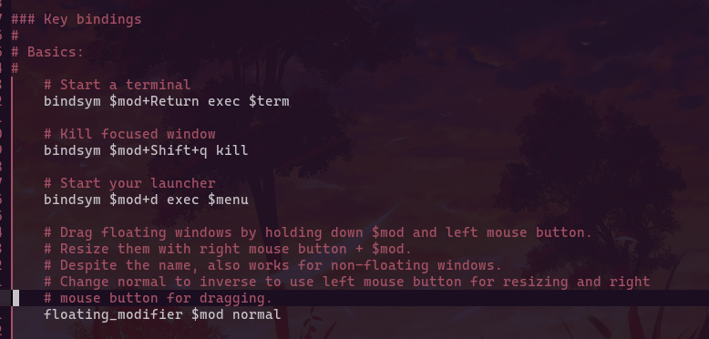
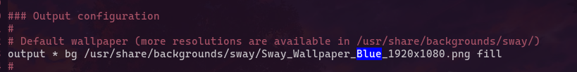

# مقدمة

سواي مدير نوافذ مشهور ب tiling layout يعتبر مثل i3 ولكن لوايلاند مما يجعله مناسب لمن يريد تجربة i3 ولكن في بروتوكول عرض وايلاند 

تخصيصه سهل جدا من اسهل مدراء النوافذ وافضلهم للبدأ به وانا استخدمه في حاسوبي الشخصي

لندخل الى الموضوع **كيف تخصص سواي**

---

## الجزء الاول - من وين تجيب ملف الكونفج

عشان تجيب ملف الكونفج فهو غالبا يقع في `/etc/sway/` او `/etc/xdg/sway` على حسب نظامك

المهم نفتح الطرفية بنظامك ونكتب
```bash
mkdir -p ~/.config/sway && cp -r /etc/sway/* ~/.config/sway
```

الان معك ملف الكونفج وبامكانك التعديل عليه حسب تفضيلك الشخصي , الان يمكننا ان ننتقل الى الخطوة التالية

---

## الجزء الثاني - اختصارات الكيبورد Keybinds

ما يتميز به اي مدير نوافذ هو ادارة النوافذ ويعتمد بشكل كامل على اختصارات الكيبورد لذا من المهم جدا تخصيص الاختصارات على حسب تفضيلك الشخصي

لنفتح ملف الكونفج بأي محرر نصوص مثل `nano` او `vim`

اذهب الى خانة Keybinds



لاضافة اختصار نقوم بكتابة

```config
    bindsym your-keybind exec command-to-execute
```

لنقل كمثال نريد اختصار mod+e ان يفتح متصفح الملفات

```config
    bindsym $mod+e exec thunar (or your file manager)
```

قمت بتخصيص اختصاراتك؟ اذا لننتقل للخطة التي بعدها

---

## الجزء الثالث - تغيير الخلفية

تريد تغيير خلفية سواي الافتراضية؟ افتح ملف الكونفج وبعدها انزل الى خانة `output`



ثم غير هذا السطر الى

```config
output * bg <مسار الخلفية الخاصة بك> fill
```

غيرت الخلفية؟ لنتنقل الى الخطوة الذي بعدها

---
## المقال ما زال غير مكتمل
